# LibC3P: Generalized Simultaneous Closed-Chain Calibration

Authors: Jin Wu, Xieyuanli Chen, Xiangcheng Hu, Chengxi Zhang, Haoang Li, Yi Jiang, Shuzhi Sam Ge, Wei Zhang, Wei He

[](https://isocpp.org/)[[](http://wiki.ros.org/)[](https://github.com/zarathustr/LibC3P/stargazers) [](https://github.com/zarathustr/LibC3P/issues)

</div>


---

## Introduction

We propose a unified framework for solving **Closed-Chain Calibration Problems ($C^3Ps$)**. This framework generalizes classical problems such as **hand-eye calibration** ($AX=XB$), **robot-world calibration** ($AX=YB$), and extends to high-order problems like $AXB=YCZ$, the novel simultaneous hand-eye/robot-camera/marker-marker calibration $AXBY=ZCWD$ formulation, the Tri-camera non-overlapping calibration. 

The core contribution is the **Physical Ensemble Method (PEM)**, a globally optimal solver that exploits homogeneous symmetry in closed-chain kinematics to improve robustness and accuracy against measurement noise.

### Key Features
* **Unified Formulation:** Solves arbitrary order closed-chain calibration problems ($C^3Ps$) in $SE(3)$.
* **Global Optimality:** Includes solvers based on Gröbner basis, Homotopy Continuation, LMI/SDP, and the proposed PEM (Physical Ensemble Method).
* **High Robustness:** PEM utilizes physically equivalent ensembles to suppress spurious local minima.
* **Diverse Applications:**
    * Classical Hand-Eye ($AX=XB$)
    * Robot-World-Hand-Eye ($AX=YB$)
    * Simultaneous Hand-Eye/Tool-Flange/Robot-Robot ($AXB=YCZ$)
    * **NEW:** Dual-arm/Multi-sensor non-overlapping calibration ($AXBY=ZCWD$)
    * **NEW:** Tri-Camera non-overlapping calibration
* **Multi-Platform Support:** C++, MATLAB, Python and ROS wrappers.

---

## Methodology & Visuals

### 1. The Concept of $C^3Ps$ 
We generalize calibration tasks into a closed-chain equation:

$$\prod_{j=1}^{P} A_{i,j} X_j = \prod_{j=1}^{Q} Y_j B_{i,j}$$
This covers scenarios from simple point cloud registration to complex multi-robot collaboration.

<div align="center">
    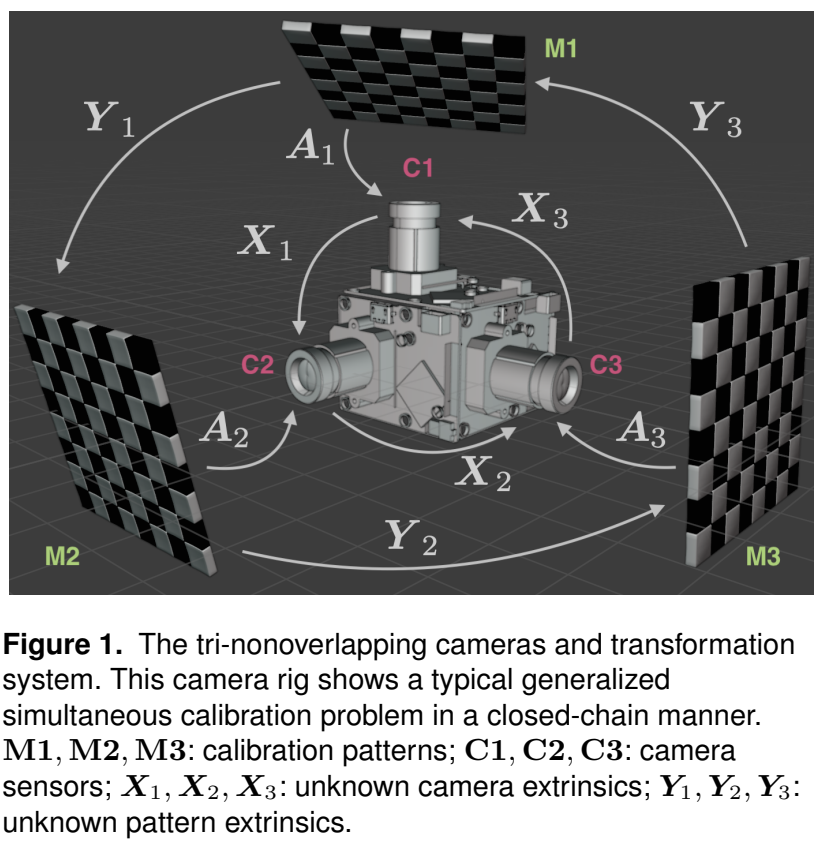
    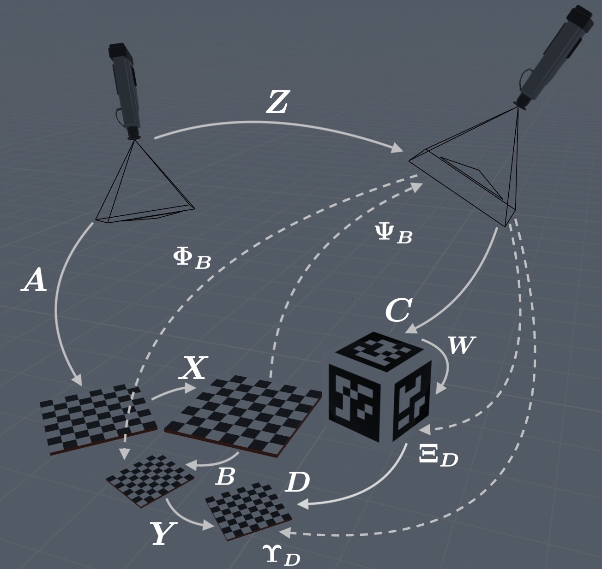
    <br>
    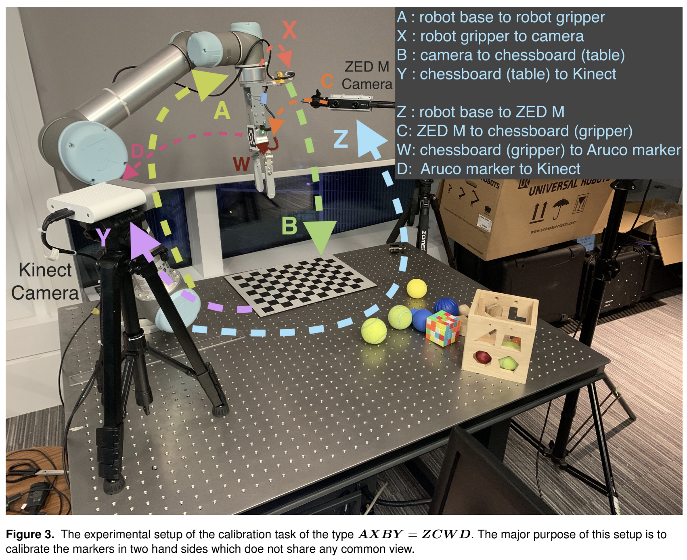
    <br>
    <em>Left: Tri-camera system (AX=YB variants). Right: Multi-sensor setup (AXBY=ZCWD).</em>
</div>

### 2. Physical Ensemble Method (PEM)
PEM constructs a "Physical Ensemble" from homogeneous symmetries (e.g., inverting the chain, cyclic shifts) to constrain the optimization landscape, ensuring convergence to the global optimum.

<div align="center">
    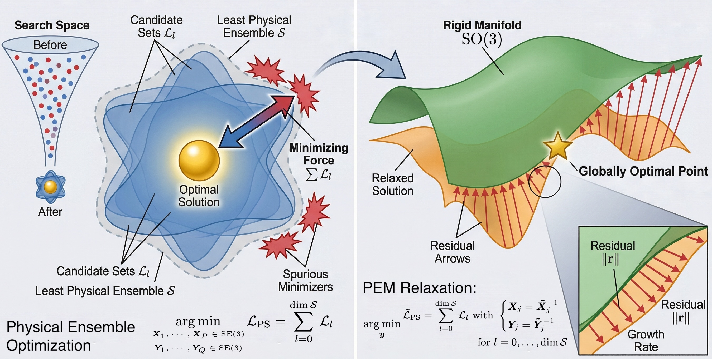
    <br>
    <em>Why physical ensemble enhances global solution of C3Ps: Left: Solution space significantly reduces after combining objective candidates in physical ensemble; Right: Rigidity guarantees near SO(3) enables polynomial-friendly approximation to SO(3) to the maximum extent.</em>
</div>
---

## Prerequisites 

The code has been tested on **macOS** and **Linux (Ubuntu)**.

* **C++ Standard:** C++17
* **ROS:** Melodic / Noetic (for ROS wrappers)
* **MATLAB:** R2023b (for verification scripts)
* **Python:** 3.10.19 for comparisons with AutoTight
* **Dependencies:**
    * Eigen3
    * OpenCV (for PnP solvers)
    * Amardillo (for optimizers)
    * [GTSAM](https://gtsam.org/) (optional, for factor graph comparison)
    * [Manopt](https://www.manopt.org/) (optional, for Riemannian optimization comparisons)

---

<div align="center">
    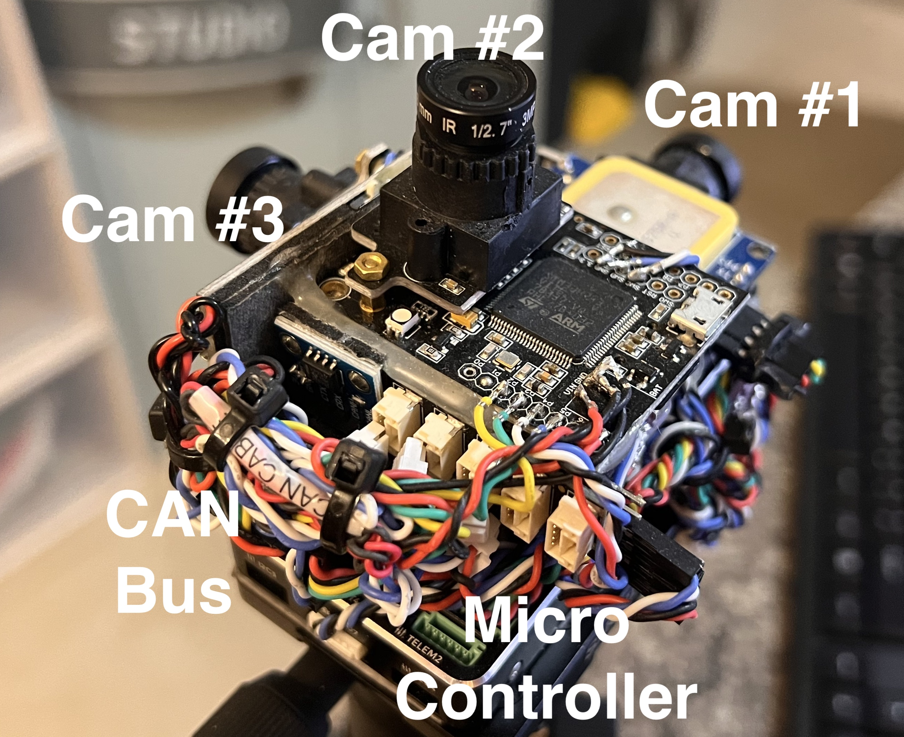
    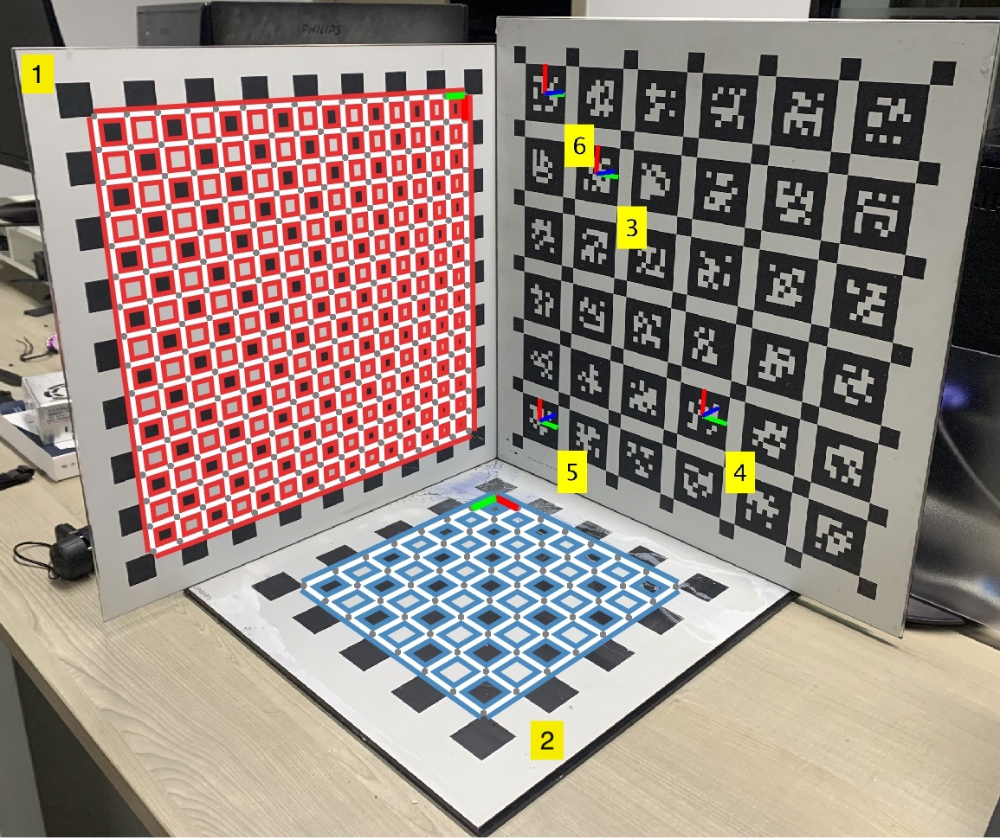
    <br>
    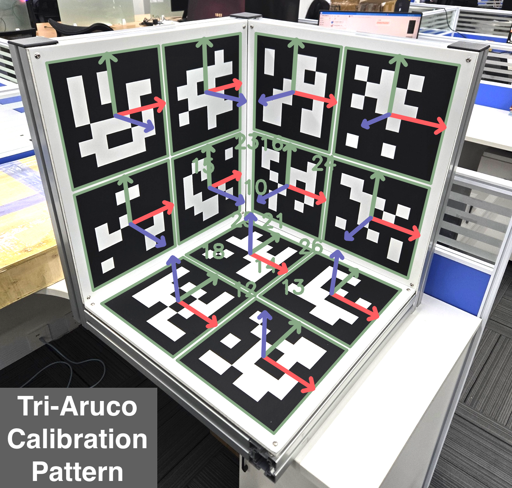
    <br>
    <em>Precisely installed calibration patterns for ground-truth verification of calibration parameters.</em>
</div>

## C++/ROS Build & Run 

### 1. Clone the repository 
```bash
git clone [https://github.com/zarathustr/LibC3P.git](https://github.com/zarathustr/LibC3P.git)
cd LibC3P
```

### 2. C++ Build
For accuracy characteristics of PEM solver for C3P, use the following commands:
```
cd c3p_accuracy_comparison
mkdir build && cd build
cmake ..
make -j4
./pem_benchmark_mc --mc 500 --N 20 --noise 0.002,0.005,0.01,0.02,0.05 --out mc_results.csv
./pem_c3p_noise_sweep --P 1 --Q 2 --noise 0.005:0.005:0.02 --mc 200 --N 20 --solver PEM --out c3p_p1q2.csv
```
The results are:

<div align="center">
    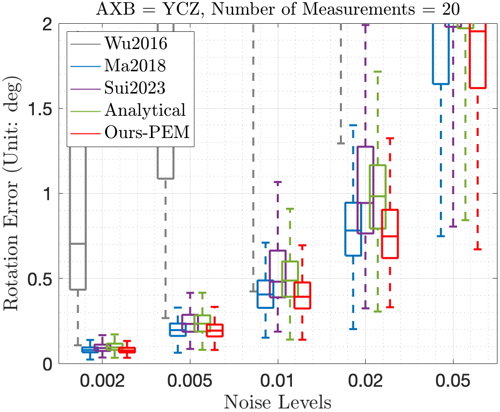
    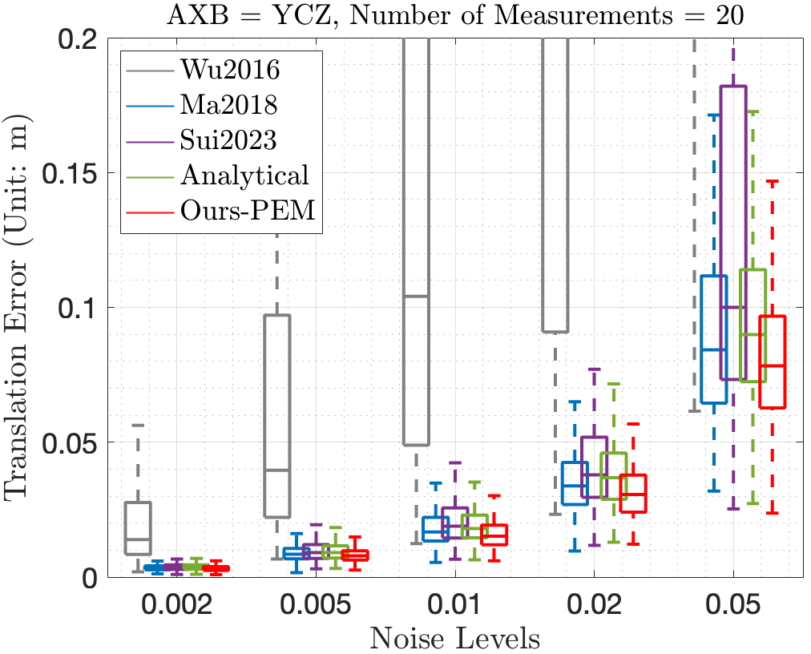
    <br>
    <em>Pose error characteristics of the Physical-Ensemble Method (PEM) for C3Ps.</em>
</div>

### 3. ROS Build

Copy the package to your catkin workspace `src` folder:

```
cp -r aruco_extrinsic_calib_C3P ~/catkin_ws/src/
cd ~/catkin_ws
catkin_make
source devel/setup.bash

# For 4cam-large-nuc dataset:
rosrun aruco_extrinsic_calib_c3p extract_aruco_from_bag --bag 4cam-large-ust-nautilus-native-0000000000-2026-01-01-06-48-53.bag --calib calib-4cam-large/calib-camchain.yaml --out_dir out --num_cams 4 --topics /sensors/cam0,/sensors/cam1,/sensors/cam2,/sensors/cam3 --tag_size 0.25 --dict DICT_6X6_250 --sync_tol 0.01 --image_mode raw

rosrun aruco_extrinsic_calib_c3p verify_extrinsics --calib calib-4cam-large/calib-camchain.yaml --camA_csv out/cam0_aruco_poses.csv --camA_idx 0 --camB_csv out/cam2_aruco_poses.csv --camB_idx 2  --sync_tol 0.01

rosrun aruco_extrinsic_calib_c3p verify_axby_zcwd --calib calib-4cam-large/calib-camchain.yaml --csv_dir out --cam0 0 --marker0 10 --cam1 1 --marker1 12 --cam2 2 --marker2 13 --cam3 3 --marker3 14 --sync_tol 0.01 --tag_size 0.25 --marker_margin 0.01 --out_xyzw out/estimated_XYZW.yaml

rosrun aruco_extrinsic_calib_c3p overlay_reprojection_zcwd_from_bag --bag 4cam-large-ust-nautilus-native-0000000000-2026-01-01-06-48-53.bag --calib calib-4cam-large/calib-camchain.yaml --xyzw_yaml out/estimated_XYZW.yaml --topics /sensors/cam0,/sensors/cam1,/sensors/cam2,/sensors/cam3 --image_mode raw --sync_tol 0.01 --sync_mode ref0 --out_dir out_reproj_zcwd --swap_rb
```

The final reprojection errors are annotated as red boxes in the detection images:

<div align="center">
    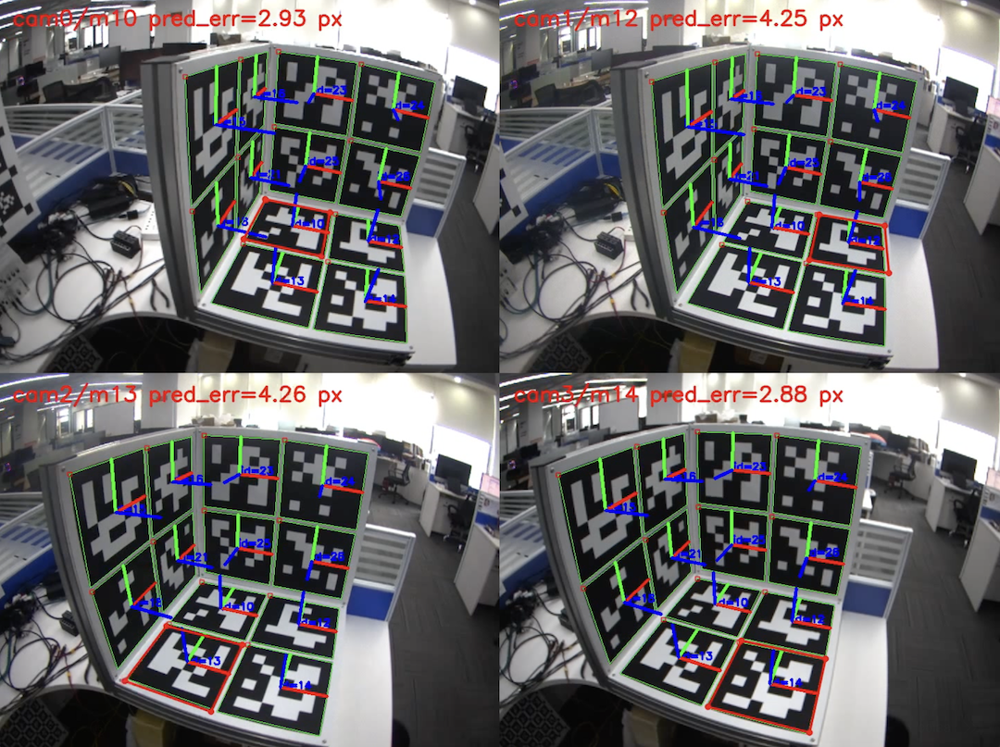
    <br>
    <em>Reprojected markers in their original positions.</em>
</div>

## MATLAB Scripts:

### Cramér-Rao Lower Bound (CRLB)
Open MATLAB and navigate to the `verification/` folder. Run `CRLB_verification.m` to verify the CRLB analysis.

<div align="center">
    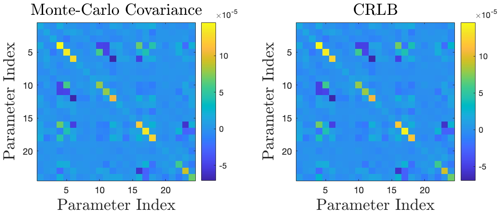
    <br>
    <em>The covariance estimation from Monte-Carlo tests and CRLB respectively.</em>
</div>

### Symbolic High-Order Lie-Group Differentiation
Open MATLAB and navigate to the `verification/` folder. Run `Lie_differentiation.m` to verify the differentiation accuracy. Using $$\frac{\mathrm{d} \ \mathrm{tr} \left( {AX}^k \right)}{\mathrm{d} {X}} = \sum \limits_{i = 0}^{k - 1} {X}^i {A} {X}^{k-i-1}, \ k \in \mathbb{Z}^+$$
which leads to

<div align="center">
    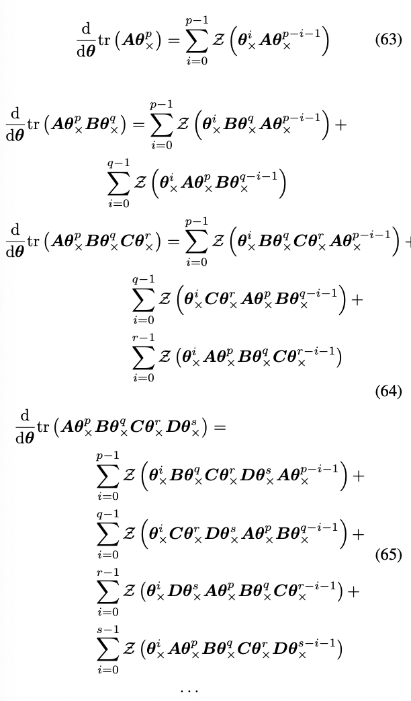
    <br>
</div>

Sample codes:
```
HHHH = jacobian(trace(A * S^p * B * S^q), r);
JJJJ1 = zeros(len, 1);
for i = 0 : p - 1
    KKK = Z_func(eval(S^i * B * S^q * A * S^(p - i - 1)), dim);
    JJJJ1 = JJJJ1 + KKK;
end
JJJJ2 = zeros(len, 1);
for i = 0 : q - 1
    KKK = Z_func(eval(S^i * A * S^p * B * S^(q - i - 1)), dim);
    JJJJ2 = JJJJ2 + KKK;
end
eval(HHHH - JJJJ1.' - JJJJ2.')


HHHH = jacobian(trace(A * S^p * B * S^q * C * S^rr), r);
JJJJ1 = zeros(len, 1);
for i = 0 : p - 1
    KKK = Z_func(eval(S^i * B * S^q * C * S^rr * A * S^(p - i - 1)), dim);
    JJJJ1 = JJJJ1 + KKK;
end
JJJJ2 = zeros(len, 1);
for i = 0 : q - 1
    KKK = Z_func(eval(S^i * C * S^rr * A * S^p * B * S^(q - i - 1)), dim);
    JJJJ2 = JJJJ2 + KKK;
end
JJJJ3 = zeros(len, 1);
for i = 0 : rr - 1
    KKK = Z_func(eval(S^i * A * S^p * B * S^q * C * S^(rr - i - 1)), dim);
    JJJJ3 = JJJJ3 + KKK;
end
eval(HHHH - JJJJ1.' - JJJJ2.' - JJJJ3.')
```
------

## Python Comparisons with ${AutoTight}$

**Python Scripts:**

Redirect to `AutoTight_comparison`:
```
# Python 3.10.19
source ~/miniforge3/etc/profile.d/conda.sh
conda activate constraint_learning

python -m _scripts.run_c3p_se3_axxb_autotight
python -m _scripts.run_c3p_se3_axyb_autotight
python -m _scripts.run_c3p_se3_axb_ycz_autotight
python -m _scripts.run_c3p_se3_axby_zcwd_autotight
```
## Logs:
For $AX=XB$, $AX=YB$, $AXB=YCZ$ problems, there is no errors for problem solving. Howver, for $AXBY=ZCWD$ problem, the solver is quite slow and failed:
```
46: -1.1803e-01 -1.1803e-01  2e-07  6e-13  1e-07  1e-09
47: -1.1803e-01 -1.1803e-01  3e-07  3e-12  1e-06  1e-09
48: -1.1803e-01 -1.1803e-01  1e-07  2e-12  6e-07  7e-10
49: -1.1803e-01 -1.1803e-01  1e-07  3e-11  3e-05  8e-10
50: -1.1803e-01 -1.1803e-01  7e-08  2e-11  1e-05  4e-10
51: -1.1803e-01 -1.1803e-01  8e-08  2e-10  3e-04  4e-10
52: -1.1803e-01 -1.1803e-01  3e-08  9e-11  1e-04  2e-10
53: -1.1803e-01 -1.1803e-01  3e-08  9e-11  1e-04  2e-10
54: -1.1803e-01 -1.1803e-01  2e-08  5e-11  8e-05  8e-11
55: -1.1803e-01 -1.1803e-01  2e-08  1e-10  3e-04  8e-11
56: -1.1803e-01 -1.1803e-01  9e-09  6e-11  2e-04  4e-11
57: -1.1803e-01 -1.1803e-01  1e-08  6e-11  2e-04  4e-11
58: -1.1803e-01 -1.1803e-01  5e-09  4e-11  1e-04  2e-11
59: -1.1803e-01 -1.1803e-01  5e-09  4e-11  2e-04  2e-11
60: -1.1803e-01 -1.1803e-01  4e-09  8e-11  4e-04  1e-11
Terminated (singular KKT matrix).
Warning: solver failed with message: infeasible / unknown: Solver 'CVXOPT' failed. Try another solver, or solve with verbose=True for more information.
Maximum error: 7.355227538141662e-15
no more variables to add
/autocity/jinwu/.conda/constraint_learning/lib/python3.10/site-packages/cvxpy/problems/problem.py:173: UserWarning: Constraint #1 contains too many subexpressions. Consider vectorizing your CVXPY code to speed up compilation.
  warnings.warn(f"Constraint #{i} contains too many subexpressions. "
/autocity/jinwu/.conda/constraint_learning/lib/python3.10/site-packages/cvxpy/problems/problem.py:173: UserWarning: Constraint #2 contains too many subexpressions. Consider vectorizing your CVXPY code to speed up compilation.
  warnings.warn(f"Constraint #{i} contains too many subexpressions. "

===== Results =====

real	9m15.702s
user	83m46.056s
sys	0m9.507s
```

## Conclusion:

$AutoTight$ will fail for $$AXBY = ZCWD$$ problems.

------

## Simulation of Multi-Camera System
This repo does not rely on ROS system but will output rosbag file accordingly. Enter `simulation_4cam_pose`:
```angular2html
mkdir build
cd build
cmake ..
make -j8

./simulation_4cam_pose ./marker1.svg ./marker2.svg ./marker3.svg out2
```
You have to provide the `marker1.svg`, `marker2.svg`, `marker3.svg` for generation of the orthogonal calibration pattern.

<div align="center">
    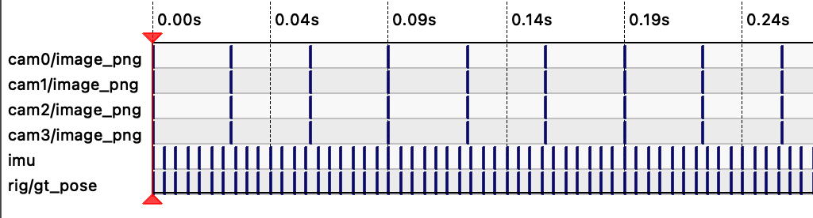
    <br>
    <em>The rosbag topics generated using synthetic motion and calibration pattern SVG files.</em>
</div>

Then, the generated rosbag file could be feed to `aruco_extrinsic_calib_c3p` ROS package for synthetic study.

## Datasets

We provide standard datasets for validating multiple practical $C^3Ps$, collected using high-precision hardware synchronization.

- `plane-aruco-2025071801`: Multi-camera Aruco calibration data.
- `4cam-jetson`: Data from NVidia Jetson NX setup.
- `4cam-nuc`: Data from Intel NUC driven 4 camera extrinsic calibration setup.
- `tencent-robot-datasets`: Industrial-robot calibration in Tencent Robotics X.

------

## Citation

If you find this work useful for your research, please cite our paper:

```bash
@article{wu2024generalized,
  title={Simultaneous Closed-Chain Calibration: Generalized Optimization, Global Solutions and Applications},
  author={Wu, Jin and Chen, Xieyuanli and Hu, Xiangcheng and Zhang, Chengxi and Li, Haoang and Jiang, Yi and Ge, Shuzhi Sam and Zhang, Wei and He, Wei},
  journal={Submission to The International Journal of Robotics Research},
  year={2026},
  publisher={Arxiv},
  url={[https://github.com/zarathustr/LibC3P](https://github.com/zarathustr/LibC3P)}
}
```

------

## Issues

For any questions, please open an issue or contact `wujin@ustb.edu.cn` or `xhubd@connect.ust.hk`.

